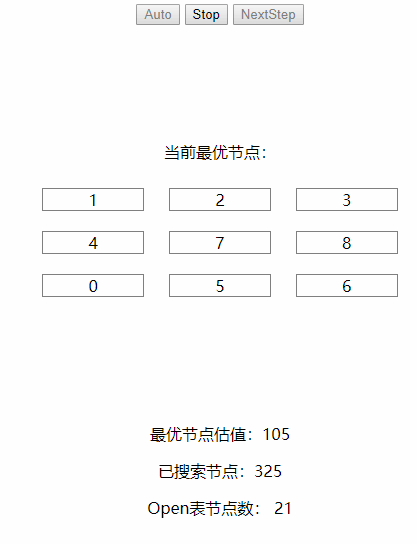
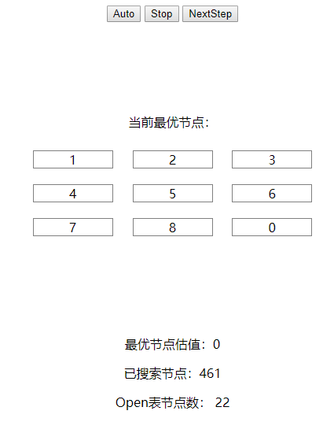
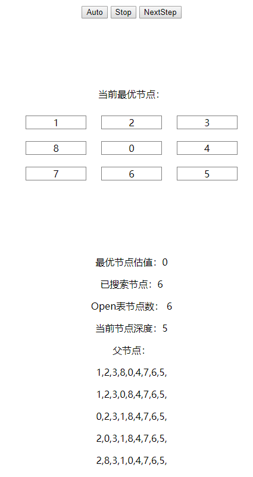
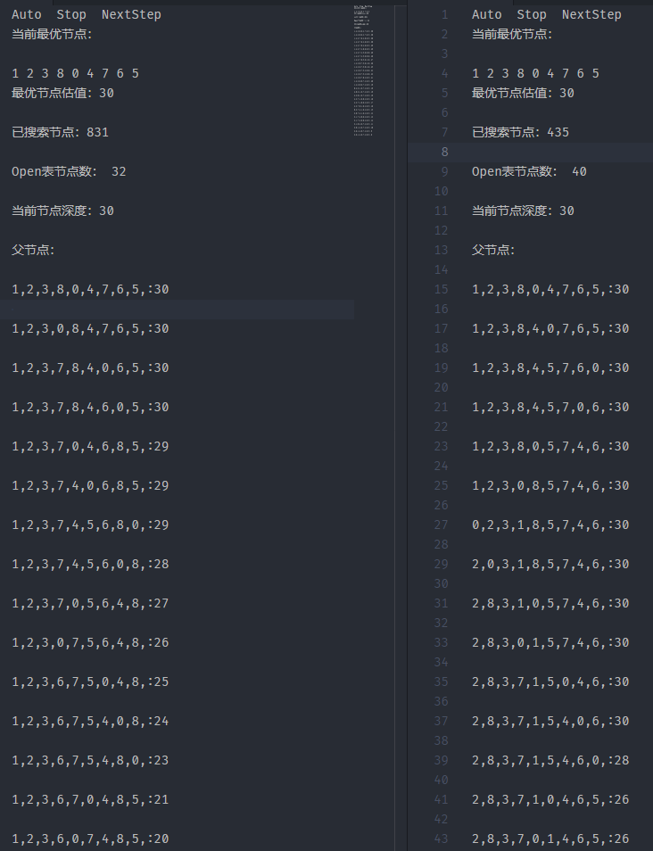

# A*算法

## 实现技术

这里使用了Go语言作为算法语言，以Html/CSS/JavaScript作为编写界面UI的语言

这里使用到了Go1.11中新增的特性`WebAssembly`，使用这个特性，我们可以把Go语言编译成可以在v8环境下执行的二进制格式。

## 解决八数码问题

首先，我们对于八数码问题使用A*算法进行求解

在A*算法中，比较重要的是对于搜索费用的估计，根据估计从小到大对于Open列表的节点进行处理，来实现启发式搜寻答案

这里定义每个节点的费用估计为` 当前节点搜索深度 + 不正确的码数`
$$
f(n) = d(n) + w(n)
$$
其中`d(n)`就是当前搜索树的深度，而`w(n)`则是放错位置的数字的个数，因此`w(n) < h*(n)`，符合`A*`算法的规范

```go
func getValue(node Node, end Node) int {
	s := 0 // 不正确的码数
	for i := 0; i < 9; i++ {
		if end.State[i] != 0 && node.State[i] != end.State[i] {
			s++
		}
	return  node.Depth + s
}
```

而搜索过程和一般的广度优先搜索差不多，只不过是把搜索队列换成根据花费估计的优先级队列

算法估计过程:

```go
func AStarNextStep() func() Info {
	startArr := []int{1, 7, 8, 2, 6, 4, 3, 0, 5}
	endArr := []int{1, 2, 3, 4, 5, 6, 7, 8, 0}
	if !isValid(startArr, endArr) {
		return func() Info {
			return Info{
				SearchedNode: 0,
				isEnd:        true,
				isSuccess:    false,
				Opened:       0,
			}
		}
	}
	start := NewNode(startArr)
	end := NewNode(endArr)
	var visitedList []Node
	var exploreList []Node
	var currentNode Node
	SearchedNode := 0

	start.Value = getValue(start, end)
	visitedList = append(visitedList, start)
	exploreList = append(exploreList, start)

	return func() Info {
		if len(exploreList) == 0 {
			return Info{
				SearchedNode: SearchedNode,
				isEnd:        true,
				isSuccess:    false,
				Opened:       len(exploreList),
			}
		}
		SearchedNode++
		currentNode = pollMinNode(&exploreList)
		if currentNode.Equals(&end) {
			currentNode.Value = getValue(currentNode, end)
			return Info{
				isSuccess:    true,
				isEnd:        true,
				CurrentNode:  currentNode,
				SearchedNode: SearchedNode,
				Opened:       len(exploreList),
			}
		}

		// 进行搜索
		nextNodes := []Node{
			CopyNode(currentNode), CopyNode(currentNode), CopyNode(currentNode), CopyNode(currentNode),
		}
		for i := 0; i < 4; i++ {
			if nextNodes[i].MoveTo(i) && !contains(&visitedList, nextNodes[i]) {
				nextNodes[i].Value = getValue(nextNodes[i], end)
				pushNode(&exploreList, nextNodes[i])
				visitedList = append(visitedList, nextNodes[i])
			}
		}
		// .Println(exploreList)
		return Info{
			isSuccess:    false,
			isEnd:        false,
			CurrentNode:  currentNode,
			SearchedNode: SearchedNode,
			Opened:       len(exploreList),
		}
	}
}
```

上面的函数返回了一个函数闭包，可以分别获取每一步节点的状态

然后通过`WebAssembly`将状态传递给前端进行处理

```go
package main

import (
	"syscall/js"
)

var nextStep = AStarNextStep()

func registerCallbacks() {
	global := js.Global()
	onSum := js.NewCallback(func(args []js.Value) {
		info := nextStep()
		global.Set("currentNode", js.ValueOf(info.CurrentNode.ToString()))
		global.Set("currentValue", js.ValueOf(info.CurrentNode.Value))
		global.Set("searchedNode", js.ValueOf(info.SearchedNode))
		global.Set("isSuccess", js.ValueOf(info.isSuccess))
		global.Set("isEnd", js.ValueOf(info.isEnd))
		global.Set("opened", js.ValueOf(info.Opened))
	})
	global.Set("next", onSum)
}

func main() {
	c := make(chan struct{}, 0)
	println("hello wasm")
	registerCallbacks()
	<-c
}
```

最后在界面上 动态显示搜索过程：



最后得出最后的结果，一共花费了461步解决了这一个八数码问题



然后使用书本上的例子，得到以下的结果：



从输出的路径来看和书本上的最优搜索路径是一样的。


## 不同估计函数的对比

使用不同的估计函数

$H_1$为放错码的个数，显然这里还远远没有考虑从放错位置到正确位置移动的困难程度，因此$H_1(n) \leq H^*(n)$

$H_2$为错误的码移动到正确位置的距离之和，因为不可以直接移动错误的码，只能移动`0`的位置来实现，因此$H_2(n)\leq H^*(n)$

下面分别是$H_1$和$H_2$运行的结果：



可以看出，两种估计函数都属于A*算法，因此具有**可采纳性**

虽然两个最优解的路径是不一样的，但是他们的搜索深度都是一样的，而且$H_2$的估计函数出来的结果经过搜索的节点比$H_1$要少很多，因此可以有着更好的效率


## 特性

下面是一个解的父节点状态以及花费估计值$f(n)$的输出

```
1,2,3,8,0,4,7,6,5,:30
1,2,3,0,8,4,7,6,5,:30
1,2,3,7,8,4,0,6,5,:30
1,2,3,7,8,4,6,0,5,:30
1,2,3,7,0,4,6,8,5,:29
1,2,3,7,4,0,6,8,5,:29
1,2,3,7,4,5,6,8,0,:29
1,2,3,7,4,5,6,0,8,:28
1,2,3,7,0,5,6,4,8,:27
1,2,3,0,7,5,6,4,8,:26
1,2,3,6,7,5,0,4,8,:25
1,2,3,6,7,5,4,0,8,:24
1,2,3,6,7,5,4,8,0,:23
1,2,3,6,7,0,4,8,5,:21
1,2,3,6,0,7,4,8,5,:20
1,2,3,0,6,7,4,8,5,:19
0,2,3,1,6,7,4,8,5,:19
2,0,3,1,6,7,4,8,5,:19
2,3,0,1,6,7,4,8,5,:19
2,3,7,1,6,0,4,8,5,:18
2,3,7,1,0,6,4,8,5,:17
2,3,7,0,1,6,4,8,5,:16
0,3,7,2,1,6,4,8,5,:15
3,0,7,2,1,6,4,8,5,:14
3,1,7,2,0,6,4,8,5,:13
3,1,7,2,6,0,4,8,5,:12
3,1,0,2,6,7,4,8,5,:11
3,0,1,2,6,7,4,8,5,:10
3,6,1,2,0,7,4,8,5,:9
3,6,1,2,8,7,4,0,5,:8
```

从上面输出的最优路径的父节点中可以看出，其估计函数必然满足$f(n) < f^*(n)$

这个特性，人工智能的发起人之一Nilsson已经用归纳法证明过，这里也可以体现出来。


## 能否达到目标状态

对于八数码问题，判断是否能达到目标状态也是很简单的

一个状态表示成一维的形式，求出除0之外所有数字的逆序数之和，也就是每个数字前面比它大的数字的个数的和，称为这个状态的逆序。

若两个状态的逆序奇偶性相同，则可相互到达，否则不可相互到达。

就是计算初始状态和目标状态的逆序数之和的奇偶性是否相等：

```go
func getInvSum(arr []int) int {
	sum := 0
	for i := range arr {
		if arr[i] != 0 {
			for j := 0; j < i; j++ {
				if arr[j] > arr[i] {
					sum++
				}
			}
		}
	}
	return sum
}

func isValid(start, end []int) bool {
	return getInvSum(start)%2 == getInvSum(end)%2
}
```

